# 🏛️ Active Directory Lab — Azure + Terraform + Ansible

Automated deployment of a Windows Active Directory domain with Linux clients on Azure. Infrastructure is provisioned with Terraform, then configured end-to-end with Ansible.

---

## Architecture

```mermaid
graph TB
    subgraph Azure["☁️ Azure (Switzerland North)"]
        subgraph VNet["Virtual Network — 10.0.0.0/16"]
            subgraph Subnet["Subnet — 10.0.1.0/24"]
                DC["🖥️ Windows Server 2019\nitidc (10.0.1.6)\nDomain Controller\nStandard_B2s"]
                RH["🐧 Red Hat Enterprise Linux 9\nredhat-linux\nDomain Client\nStandard_B1ls"]
                UB["🐧 Ubuntu 20.04 LTS\nubuntu-linux\nDomain Client\nStandard_B1ls"]
            end
        end
        NSG["🔒 Network Security Group\nAllow All Inbound/Outbound"]
    end

    DC -->|"AD DS + DNS\niti.local"| RH
    DC -->|"AD DS + DNS\niti.local"| UB
    Subnet --- NSG
```

```mermaid
sequenceDiagram
    participant Dev as 🧑‍💻 Developer
    participant TF as Terraform
    participant Azure as Azure Cloud
    participant Ansible as Ansible Controller
    participant DC as Windows DC
    participant Linux as Linux VMs

    Dev->>TF: terraform apply
    TF->>Azure: Provision VMs + Networking
    TF->>DC: Install WinRM via CustomScriptExtension
    Azure-->>Dev: Output public IPs

    Dev->>Ansible: ansible-playbook playbook.yaml

    Note over Ansible,DC: Play 1 — Setup Active Directory
    Ansible->>DC: Set hostname → itidc
    Ansible->>DC: Set DNS → 127.0.0.1
    Ansible->>DC: Create AD forest (iti.local)
    Ansible->>DC: Promote to Domain Controller
    Ansible->>DC: Configure Root CA (ADCS)
    Ansible->>DC: Create domain users
    Ansible->>Ansible: Fetch CA certificate

    Note over Ansible,Linux: Play 2 — Join Linux to Domain
    Ansible->>Linux: Set FQDN hostname
    Ansible->>Linux: Configure DNS → DC IP
    Ansible->>Linux: Install realmd / sssd / adcli
    Ansible->>Linux: realm join iti.local
    Ansible->>Linux: Enable PAM home directory creation
```





---

## Project Structure

```
.
├── terraform/
│   ├── main.tf          # VMs, VNet, NSG, NICs, Public IPs
│   ├── variables.tf     # Input variables
│   ├── outputs.tf       # Public IP outputs
│   └── provider.tf      # AzureRM provider config
│
└── ansible/
    ├── ansible.cfg      # Inventory, SSH key, remote user
    ├── playbook.yaml    # Main playbook (2 plays)
    ├── inventory.ini    # Host groups
    ├── run.sh           # Deploy script (SCP + SSH)
    └── roles/
        ├── win/         # Windows DC role
        │   ├── tasks/
        │   │   ├── main.yml         # Task orchestration
        │   │   ├── setup_net.yml    # Hostname + DNS
        │   │   ├── setup_ad.yml     # Forest + DC promotion
        │   │   ├── config_users.yml # Domain users
        │   │   └── setup_cert.yml   # ADCS Root CA
        │   ├── handlers/main.yml    # gpupdate /force
        │   └── vars/
        │       ├── main.yml         # domain_name, CA settings
        │       ├── pass.yml         # 🔐 Vault: passwords
        │       └── users.yml        # 🔐 Vault: user list
        │
        └── linux/       # Linux domain-join role
            ├── tasks/
            │   ├── main.yml              # Task orchestration
            │   ├── setup_dns_cert.yml    # DNS → DC, Netplan/nmcli
            │   ├── install_packages.yml  # realmd, sssd, adcli…
            │   └── join_ad.yml           # realm join + PAM setup
            ├── handlers/main.yml         # Restart networkd/NM
            └── vars/main.yml             # domain_name: iti.local
```

---

## Prerequisites

| Tool             | Version                |
| ---------------- | ---------------------- |
| Terraform        | >= 1.0                 |
| Ansible          | >= 2.12                |
| Azure CLI        | Latest                 |
| Python `pywinrm` | For WinRM connectivity |

---

## Deployment

### 1. Provision Infrastructure

```bash
cd terraform/

# Authenticate to Azure
az login

# Set the VM admin password
export TF_VAR_admin_password="YourSecurePassword123!"

terraform init
terraform apply
```

Note the output public IPs and update `ansible/inventory.ini`.

### 2. Configure the Vault Password File

```bash
echo "your-vault-password" > ansible/pass_vault_file
chmod 600 ansible/pass_vault_file
```

### 3. Run Ansible

**Locally:**

```bash
cd ansible/
ansible-playbook playbook.yaml --vault-password-file pass_vault_file
```

---

## Ansible Vault

Sensitive values are encrypted with Ansible Vault:

| File                       | Contents                                                          |
| -------------------------- | ----------------------------------------------------------------- |
| `roles/win/vars/pass.yml`  | `domain_admin_password`, `safe_mode_password`, `ansible_password` |
| `roles/win/vars/users.yml` | Domain user list with passwords                                   |

To edit vault files:

```bash
ansible-vault edit roles/win/vars/pass.yml --vault-password-file pass_vault_file
```

---

## Key Configuration

| Parameter       | Value                                         |
| --------------- | --------------------------------------------- |
| Domain          | `iti.local`                                   |
| DC Hostname     | `itidc`                                       |
| DC Private IP   | `10.0.1.6`                                    |
| CA Common Name  | `iti`                                         |
| Windows VM Size | `Standard_B2s` (2 vCPU / 4 GB)                |
| Linux VM Size   | `Standard_B1ls` (1 vCPU / 0.5 GB + 1 GB swap) |
| Azure Region    | Switzerland North                             |

---

## OS-Specific Behavior

### Ubuntu

- DNS configured via **Netplan** (`/etc/netplan/60-custom-dns.yaml`)
- PAM home directory via `pam_mkhomedir` in `/etc/pam.d/common-session`
- Packages: `realmd`, `sssd`, `libnss-sss`, `libpam-sss`, `packagekit`

### Red Hat

- DNS configured via **NetworkManager** (`community.general.nmcli`)
- Home directories via `authselect enable-feature with-mkhomedir` + `oddjobd`
- Packages: `realmd`, `sssd`, `oddjob`, `oddjob-mkhomedir`, `samba-common-tools`

---

## Security Notes

> ⚠️ The NSG currently allows **all inbound and outbound traffic**. This is suitable for a lab environment only. Tighten rules before any production use.

> ⚠️ WinRM is configured to allow unencrypted basic auth for Ansible connectivity. Use HTTPS WinRM or SSH for production Windows management.
